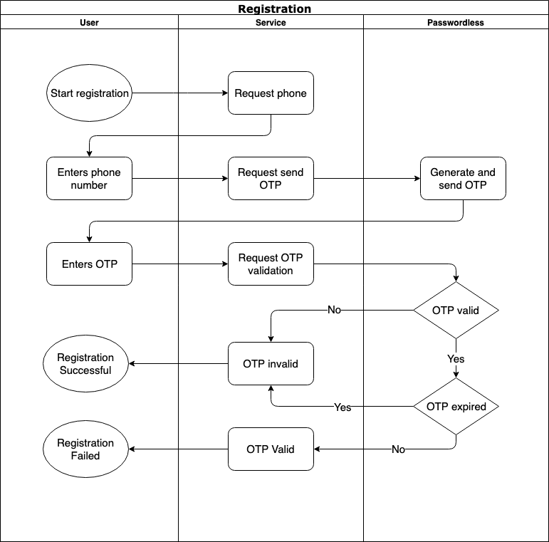

# Passwordless Authentication Service

Helps to authenticate users without providing password.

# Table of contents

- [How it works](#how-it-works)
- [Quick start](#quick-start)
- [Using One Time Password Authentication](#using-one-time-password-authentication)
  * [Introduction](#introduction)
  * [Sample Use Cases](#sample-use-cases)
    + [Registration Process](#registration-process)
    + [Authentication Process](#authentication-process)
    + [Essential Operation Confirmation (Authorization)](#essential-operation-confirmation-authorization)
  * [Customize Settings](#customize-settings)
- [Using Web Authentication (WebAuthn)](#using-web-authentication-webauthn)
  * [Prerequisites](#prerequisites)
  * [Using Javascript SDK](#using-javascript-sdk)
    + [Registration](#registration)
    + [Login](#login)


# How it works
So, you have a site or a web service what needs passwordless authentication, or needs second factor authentication. 
Passworless service is the simpler way to implement it. You just install it and integrate it with your site.
Passworldess service is used for authentication with an 
[one time password](https://en.wikipedia.org/wiki/One-time_password) (OTP) or using the 
[Web Authentication](https://en.wikipedia.org/wiki/WebAuthn) (WebAuthn) protocol.

You just call Passwordless API service and in the case of OTP authentication service generates, sends, and validates a one-time password.
In the case of WebAuthn, the Passwordless service registers or authenticates the user's public key.

You can also use it as second authentication factor (2FA) alongside with login and password or to authorize essential 
operations (for example, change password, or confirm payment) for the already authenticated user.


# Quick start

There are several ways to run passwordless service:

Run from source code
```
$> ./mvnw spring-boot:run
```

Run as a Docker image
```
$> docker run --publish=8080:8080  maximthomas/passwordless
```

Build and run docker image using docker-compose
```
$> ./mvnw install
$> docker-compose up --build 
```

# One Time Password Authentication

## Introduction

A user enters credentials on your site, you get phone or email from the users credentials, and call Passwordless service API.
Passwordless service generates and sends one time password (OTP) to the users phone or email using desired provider - SMS or Mail server.
The user enters this OTP and then you verify it at Passwordless service. 
If verification was successful, the user can be authenticated.

## Sample Use Cases

### Registration Process
While registering the user enters his phone number or email among other data. 
Site calls Passwordless service to comfirm users email or phone number, to be sure that phone or email belongs to the user.
After user enters valid OTP, user account with confirmed phone or email can be created.

This process shown on the diagram below:


### Authentication Process
While authentication the user enters his login, site gets users phone number or email from his profile and calls 
Passwordless service. Passwordless service sends OTP to the users phone or email. Users enters OTP, if OTP is valid, 
the user can be authenticated.

### Essential Operation Confirmation (Authorization)
If there'a need to change password, restore password or confirm purchase or payment, site calls Passwordless service
to be sure that exactly the user performs this critical operation. 

## Customize Settings

Adjust settings in [application.yml](./src/main/resources/application.yml) in the `otp/settings` section
```yaml
#dummy OTP sender (does noting just logs)
- id: "sms"
  name: "Dummy SMS OTP Setting"
  messageTitle: "Acme LLC"
  messageTemplate: "Confirmation code: ${otp}"
  otpLength: 5
  useLetters: false
  useDigits: true
  ttlMinutes: 3
  sender: "dummyOTPSender"

#Twilio SMS Sender
- id: "twilioSms"
  name: "Twilio SMS OTP Setting"
  messageTitle: "Acme LLC"
  messageTemplate: "Confirmation code: ${otp}"
  otpLength: 5
  useLetters: false
  useDigits: true
  ttlMinutes: 3
  sender: "twilioOTPSender"

#Email OTP Link Sender
- id: "email"
  name: "TEST Email"
  messageTitle: "Thank yor for registration"
  messageTemplate: "Temporary link: http://acme.com?link=${otp}"
  otpLength: 36
  useLetters: true
  useDigits: true
  ttlMinutes: 180 #three hours
  sender: "emailOTPSender"
```

Send OTP to client with SMS setting:
```
curl -X POST -d '{"destination": "+1999999999"}'  -H "Content-Type: application/json" 'http://localhost:8080/otp/v1/sms/send' 
```
where `/sms/` - otp settings ID from `.yaml` settings file
Sample response:
```
{"operationId":"993e61be-23cf-412d-8273-f02e316e8689"}
```

Validate OTP with `operationId`:
```
curl -X POST -d '{"operationId": "993e61be-23cf-412d-8273-f02e316e8689", "otp": "123456"}'  -H "Content-Type: application/json" 'http://localhost:8080/otp/v1/verify'
```
Sample response: 
```
{"verified":false}
```

# Using Web Authentication (WebAuthn)

Passwordless service can be used to provide WebAuthn Registration and Login functions both on server using API and on client using JavaScript SDK.

## Prerequisites
Setup required origin in `webauthn-sample-settings.yaml` in `origin` setting.

And run Passwordless Service from docker compose

## Using Javascript SDK

Just add to your web application SDK script and initialize SDK:
```html
<script src="http://passwordless-service:8080/js/passwordless-sdk.js"></script>
<script>
    Passwordless.init({host: 'http://passwordless-service:8080'});
</script>
``` 
Full example is [here](./examples/jssdk)

### Registration

Just call  
```javascript
Passwordless.webauthn.startRegistration(login);
```
where `login` - your username, and dialog asking you to insert USB Token will appear.
After successful registration SDK will return credenital Id value.


### Login
If your account already registered via startRegistration function and you want to authenticate, call
```javascript
Passwordless.webauthn.startLogin(login);
```

